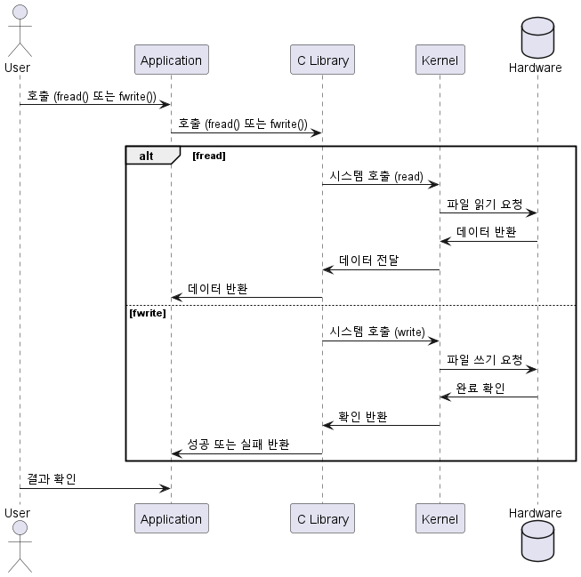
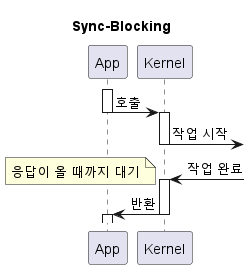
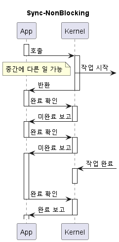
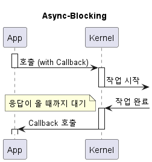
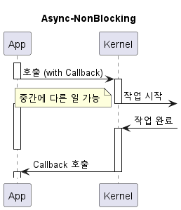

# Compression for Embedded Systems

## 개요
이 프로젝트는 Embedded 환경에서 효과적이고 안정적인 압축을 수행하기 위한 예제 코드입니다.  
- **낮은 자원 소모**로 제한된 환경에서도 동작 가능  
- **고속 압축 알고리즘**을 적용하여 성능 최적화  
- **Non-Blocking 방식**을 사용하여 작업 효율 최적화  

사용되는 압축 라이브러리는 **LZ4** 및 <strong>Zstandard (ZSTD)</strong>이며, 효율적인 데이터 압축과 빠른 처리 속도를 제공합니다.  

---

## 목차
- [Compression for Embedded Systems](#compression-for-embedded-systems)
  - [개요](#개요)
  - [목차](#목차)
  - [왜 Non-Blocking, Low Resource, High-Speed 압축이 필요한가?](#왜-non-blocking-low-resource-high-speed-압축이-필요한가)
    - [Embedded System에서 압축이 필요한 이유](#embedded-system에서-압축이-필요한-이유)
    - [Embedded System 에서 File I/O 작업 시 Thread Hang 방지 전략](#embedded-system-에서-file-io-작업-시-thread-hang-방지-전략)
        - [File System](#file-system)
      - [File I/O 작업 시 Thread Hang 발생 원인](#file-io-작업-시-thread-hang-발생-원인)
      - [File I/O 작업 시 Thread Hang 방지 전략](#file-io-작업-시-thread-hang-방지-전략)
      - [System 상태 Monitoring](#system-상태-monitoring)
    - [동기(Synchronous) vs 비동기(Asynchronous), Blocking vs Non-Blocking](#동기synchronous-vs-비동기asynchronous-blocking-vs-non-blocking)
      - [개념 설명](#개념-설명)
      - [UML 예시](#uml-예시)
      - [비동기, Non-Blocking 구현 방법 (설계 패턴, Win API 등 활용)](#비동기-non-blocking-구현-방법-설계-패턴-win-api-등-활용)
    - [낮은 자원 소모 및 고속 처리가 중요한 이유](#낮은-자원-소모-및-고속-처리가-중요한-이유)
  - [압축 알고리즘](#압축-알고리즘)
    - [압축 알고리즘 종류 및 특징](#압축-알고리즘-종류-및-특징)
      - [LZ4](#lz4)
      - [Zstandard (ZSTD)](#zstandard-zstd)
    - [Benchmarks](#benchmarks)
      - [from lz4](#from-lz4)
      - [from zstd](#from-zstd)
  - [LICENSE](#license)
  - [결론](#결론)

---

## 왜 Non-Blocking, Low Resource, High-Speed 압축이 필요한가?  

### Embedded System에서 압축이 필요한 이유  
Embedded System에서는 **저장 공간과 Network 대역폭이 제한적**이기 때문에 압축이 필수적입니다.  
- **Log Data 압축:** 저장 공간 절약 및 데이터 송신 비용 감소  
- **Network 전송 최적화:** 압축을 통해 데이터 크기를 줄여 전송 속도 향상  
- **File System 활용:** 제한된 저장소에 더 많은 데이터를 보관 가능  

### Embedded System 에서 File I/O 작업 시 Thread Hang 방지 전략
**Embedded System은 Resource가 제한된 환경에서 실시간으로 동작**해야 하므로, 중요도가 낮은 작업이 우선 작업을 방해하지 않도록 하는 것이 중요합니다.
Logging 이나 압축 작업과 같은 File I/O 작업이 실행 중인 상황에서도 실시간 처리를 원활하게 진행해야 합니다.

##### File System

#### File I/O 작업 시 Thread Hang 발생 원인
**Kernal Mode는 한정적**이며, 사용 가능한 Resource가 모두 소진될 경우 프로세스가 <strong>대기 상태(Blocking)</strong>에 들어갑니다.  
만약 **중요한 프로세스**가 대기 상태로 들어가면, System 전체가 지연되거나 심각한 장애가 발생할 수 있습니다.  
- Kernel 입장에서는 Blocking 요청과 Non-Blocking 요청 모두 동일하게 Queue에 쌓이기 때문에, Queue가 포화 상태일 때 새로운 Blocking 요청이 들어오면 응답 지연 및 Thread Hang이 발생할 수 있습니다.

#### File I/O 작업 시 Thread Hang 방지 전략
따라서, 주요 프로세스에서 상대적으로 **우선순위가 낮은 작업**의 File I/O 작업은 핵심 Logic의 실행을 방해하지 않도록 다음과 같은 방법 등으로 처리해야 합니다.  

- **File I/O 작업을 수행하지 않도록 처리**
- **Non-Blocking 방식으로 처리**
- **별도 Thread를 통해 비동기적으로 처리**

이러한 방식으로 중요 프로세스의 실행을 방해하지 않으면서, 시스템의 효율성을 높일 수 있습니다.

다만, 무조건적으로 Non-Blocking 이나 비동기로 처리하는 것은 오버헤드로 인한 성능 저하를 야기할 수 있습니다.
따라서 어떤 방법을 취할지는 신중하게 고려해야 합니다.

#### System 상태 Monitoring  
Windows **성능 모니터**에서는 **Disk Queue Length**와 같은 값을 통해 I/O 작업 대기 등의 정보를 확인할 수 있습니다.
- 관련 상세 내용: [https://learn.microsoft.com/ko-kr/previous-versions/technet-magazine/cc718984(v=msdn.10)?redirectedfrom=MSDN](https://learn.microsoft.com/ko-kr/previous-versions/technet-magazine/cc718984(v=msdn.10)?redirectedfrom=MSDN)

### 동기(Synchronous) vs 비동기(Asynchronous), Blocking vs Non-Blocking  

#### 개념 설명

| 용어          | 설명                                                   | 특징                               | 예시                                         |
|---------------|--------------------------------------------------------|-----------------------------------|----------------------------------------------|
| **동기 (Synchronous)**      | 요청한 작업이 완료될 때까지 기다림                    | 순차 작업 O (Start -> A -> B -> End)  | File 읽기 후 완료될 때까지 대기                  |
| **비동기 (Asynchronous)**   | 요청 후 즉시 다음 작업 수행 가능                       | 순차 작업 X (Start -> A, B -> End)   | Network 요청 후 응답을 기다리지 않고 다른 작업 수행 |
| **Blocking**         | Resource가 사용 가능할 때까지 대기                       | 작업 완료까지 대기 O (제어권을 넘기고, Thread Blocking) | I/O 작업이 끝날 때까지 프로그램 정지                |
| **Non-Blocking**     | Resource가 사용 불가능하면 즉시 반환, 다른 작업 수행 가능 | 작업 완료까지 대기 X (제어권 바로 반환)  | I/O가 준비되지 않으면 다른 작업 수행 후 다시 시도     |

#### UML 예시

|              |   Blocking   | Non-Blocking |
|--------------|--------------|--------------|
| Synchronous  |  |  |
| Asynchronous |  |  |

#### 비동기, Non-Blocking 구현 방법 (설계 패턴, Win API 등 활용)

| 방법                                       | 설명                                               | 추가 정보                                                         | 비동기 | Non-Blocking |
|------------------------------------------|--------------------------------------------------|-----------------------------------------------------------------|------------------|------------------------|
| Multi-Thread (Thread Pool)                   | 미리 생성한 여러 Threads를 통해, 여러 작업을 동시에 수행 |                                                             | O                | X                      |
| ReadFile, WriteFile + OVERLAPPED IO 구조체 | ReadFile, WriteFile는 동기 및 비동기 모두 사용 가능     | OVERLAPPED IO는 비동기 I/O 작업에 필요한 정보를 포함           | O                | O                      |
| ReadFileEx, WriteFileEx + OVERLAPPED IO 구조체 | ReadFileEx, WriteFileEx는 비동기만 가능하며, 완료 시 Call Back 함수를 호출함  | OVERLAPPED IO는 비동기 I/O 작업에 필요한 정보를 포함 | O                | O                      |

### 낮은 자원 소모 및 고속 처리가 중요한 이유  
Embedded System에서는 **CPU, 메모리, 스토리지, Network 대역폭**이 제한적이므로, 압축 알고리즘이 **낮은 자원 사용량**을 유지하면서도 **고속으로 동작**해야 합니다.  
  
- **낮은 자원 소모:**  
  - CPU 사용량 최소화  
  - 메모리 사용량 절감  
  - 저전력 소비 유지  

- **고속 처리의 필요성:**  
  - **Network 데이터 송신 시 지연 최소화**  
  - **Thread Blocking 방지** → 실시간 처리가 중요한 환경에서는 **I/O 지연이 치명적**일 수 있음  

---

## 압축 알고리즘
이 프로젝트는 **LZ4**와 **Zstandard(ZSTD)** 압축 알고리즘을 사용합니다.  

### 압축 알고리즘 종류 및 특징

#### LZ4  
- 초고속 압축 및 해제
- 낮은 CPU 사용량
- Windows 에서 기본 압축 해제 제공하지 않아, 별도 프로그램으로 해재해야 함
- License : BSD 2-Clause (the others : GPLv2.0)
  - all files in the `lib` directory use a BSD 2-Clause license
  - all other files use a GPL-2.0-or-later license, unless explicitly stated otherwise
- 공식 사이트: [https://github.com/lz4/lz4](https://github.com/lz4/lz4)  

#### Zstandard (ZSTD)  
- 높은 압축률과 빠른 속도 제공
- CPU 및 메모리 사용량 조절 가능
- Windows 11 에서 기본 압축 해제 제공
- License : BSD OR GPLv2 (dual-licensed)
- 공식 사이트: [https://github.com/facebook/zstd](https://github.com/facebook/zstd)  

### Benchmarks

#### from lz4

The benchmark uses [lzbench], from @inikep
compiled with GCC v8.2.0 on Linux 64-bits (Ubuntu 4.18.0-17).
The reference system uses a Core i7-9700K CPU @ 4.9GHz (w/ turbo boost).
Benchmark evaluates the compression of reference [Silesia Corpus]
in single-thread mode.

[lzbench]: https://github.com/inikep/lzbench
[Silesia Corpus]: http://sun.aei.polsl.pl/~sdeor/index.php?page=silesia

|  Compressor             | Ratio   | Compression | Decompression |
|  ----------             | -----   | ----------- | ------------- |
|  memcpy                 |  1.000  | 13700 MB/s  |  13700 MB/s   |
|**LZ4 default (v1.9.0)** |**2.101**| **780 MB/s**| **4970 MB/s** |
|  LZO 2.09               |  2.108  |   670 MB/s  |    860 MB/s   |
|  QuickLZ 1.5.0          |  2.238  |   575 MB/s  |    780 MB/s   |
|  Snappy 1.1.4           |  2.091  |   565 MB/s  |   1950 MB/s   |
| [Zstandard] 1.4.0 -1    |  2.883  |   515 MB/s  |   1380 MB/s   |
|  LZF v3.6               |  2.073  |   415 MB/s  |    910 MB/s   |
| [zlib] deflate 1.2.11 -1|  2.730  |   100 MB/s  |    415 MB/s   |
|**LZ4 HC -9 (v1.9.0)**   |**2.721**|    41 MB/s  | **4900 MB/s** |
| [zlib] deflate 1.2.11 -6|  3.099  |    36 MB/s  |    445 MB/s   |

[zlib]: http://www.zlib.net/
[Zstandard]: http://www.zstd.net/

#### from zstd

For reference, several fast compression algorithms were tested and compared
on a desktop featuring a Core i7-9700K CPU @ 4.9GHz
and running Ubuntu 24.04 (`Linux 6.8.0-53-generic`),
using [lzbench], an open-source in-memory benchmark by @inikep
compiled with [gcc] 14.2.0,
on the [Silesia compression corpus].

[lzbench]: https://github.com/inikep/lzbench
[Silesia compression corpus]: https://sun.aei.polsl.pl//~sdeor/index.php?page=silesia
[gcc]: https://gcc.gnu.org/

| Compressor name         | Ratio | Compression| Decompress.|
| ---------------         | ------| -----------| ---------- |
| **zstd 1.5.7 -1**       | 2.896 |   510 MB/s |  1550 MB/s |
| [zlib] 1.3.1 -1         | 2.743 |   105 MB/s |   390 MB/s |
| brotli 1.1.0 -0         | 2.702 |   400 MB/s |   425 MB/s |
| **zstd 1.5.7 --fast=1** | 2.439 |   545 MB/s |  1850 MB/s |
| **zstd 1.5.7 --fast=3** | 2.241 |   635 MB/s |  1980 MB/s |
| quicklz 1.5.0 -1        | 2.238 |   520 MB/s |   750 MB/s |
| lzo1x 2.10 -1           | 2.106 |   650 MB/s |   780 MB/s |
| [lz4] 1.10.0            | 2.101 |   675 MB/s |  3850 MB/s |
| snappy 1.2.1            | 2.089 |   520 MB/s |  1500 MB/s |
| lzf 3.6 -1              | 2.077 |   410 MB/s |   820 MB/s |

[zlib]: https://www.zlib.net/
[lz4]: https://lz4.github.io/lz4/

---

## LICENSE  
이 프로젝트는 **Apache License 2.0**을 따릅니다.  
자세한 내용은 [LICENSE](LICENSE) File을 참고하세요.  

---

## 결론  
Embedded 환경에서 위와 같은 기법을 사용하면, 아래와 같은 이점을 얻을 수 있습니다.
- **주요 프로세스의 안정성 유지**  
- **System 지연 최소화**  
- **제한된 리소스를 효율적으로 활용**  

이 프로젝트를 통해 **최적화된 압축 방식이 필요한 환경에서 효과적인 솔루션을 제공**할 수 있기를 기대합니다.  
